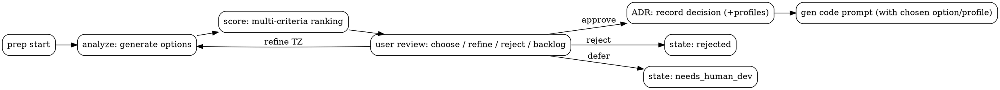

# prep как конкретизация ТЗ

## цели prep

* собрать исходные данные (окружение, ключи) — *если нужно*;
* **сгенерировать варианты реализации** навыка (в т. ч. конкурирующие);
* вскрыть **несовместимости** и взаимные ограничения;
* запросить у пользователя выбор пути и уровень компромиссов;
* зафиксировать решение в артефактах (ADR/decision record) и перейти к генерации кода — либо отложить/отказать.

---

# поток работ (операционный)

## 1) старт prep

```
adaos skill prep start <skill>
```

что делает:

* читает `skill.yaml` (черновик целей/интентов), опционально `context.md` (предпочтения, ограничения);
* подготавливает LLM‑промпт для анализа постановки задачи;
* (необязательно) выполняет «окруженческие» проверки.

## 2) анализ вариантов (LLM → варианты решений)

```
adaos skill prep analyze <skill>
```

выход: `prep/options.json` — *матрица вариантов*:

```json
{
  "problem": "краткое формулирование задачи",
  "options": [
    {
      "id": "O1-json_tool_only",
      "summary": "json-only навык, чистый tool без внешних API",
      "approach": ["llm function calling", "жёсткая json-схема"],
      "pros": ["быстро", "минимум интеграций"],
      "cons": ["ограниченные возможности"],
      "incompatibilities": ["O3-event_streaming"],
      "requirements": {"latency_ms":"<=2500", "cost_tps":"<=0.2$"},
      "risks": [{"name":"hallucination","mitigation":"json-schema validation + retries"}]
    },
    {
      "id": "O2-api_wrapper",
      "summary": "обёртка над внешним API с планированием LLM",
      "approach": ["tool planner", "http api client"],
      "pros": ["богатый функционал"],
      "cons": ["зависимость от SLA API"],
      "incompatibilities": [],
      "requirements": {"api":"external_weather","auth":"apikey"},
      "risks": [{"name":"rate limit","mitigation":"кэш + backoff"}]
    },
    {
      "id": "O3-event_streaming",
      "summary": "потоковые ответы со статусами и частичным выводом",
      "approach": ["server-sent events", "chunked output"],
      "pros": ["лучшая UX для долгих задач"],
      "cons": ["сложнее инфраструктура"],
      "incompatibilities": ["O1-json_tool_only"]
    }
  ],
  "evaluation": { "criteria": ["latency","cost","complexity","robustness"] }
}
```

## 3) сравнительная таблица и скоринг

```
adaos skill prep score <skill> \
  --weights '{"latency":0.35,"cost":0.25,"complexity":0.20,"robustness":0.20}'
```

выход: `prep/scorecard.json` — ранжирование + пояснения:

```json
{
  "weights": {"latency":0.35,"cost":0.25,"complexity":0.2,"robustness":0.2},
  "scores": [
    {"option":"O1-json_tool_only","total":0.78,"by":{"latency":0.9,"cost":0.9,"complexity":0.95,"robustness":0.35}},
    {"option":"O2-api_wrapper","total":0.73,"by":{"latency":0.7,"cost":0.6,"complexity":0.5,"robustness":0.9}},
    {"option":"O3-event_streaming","total":0.62,"by":{"latency":0.55,"cost":0.55,"complexity":0.35,"robustness":0.85}}
  ],
  "conflicts": [
    {"a":"O1-json_tool_only","b":"O3-event_streaming","reason":"один код не закрывает оба UX-паттерна без ветвления"}
  ]
}
```

## 4) опросник пользователя (human‑in‑the‑loop)

```
adaos skill review open <skill> --stage prep
```

показываем:

* цель и 3–5 лучших вариантов с плюсами/минусами;
* **вопросы‑разделители** (важно, чтобы выявить несовместимые ожидания):

  * приоритет: скорость ответа vs полнота функции?
  * офлайн‑устойчивость важнее, чем потоковый UX?
  * допустим ли внешний API с ключом? где хранить ключ?
  * json‑только ответ обязателен? допустим ли «богатый» формат?
  * бюджет на токены / месяц?
* действия пользователя:

  * ✔ выбрать вариант (или набор совместимых вариантов),
  * ✎ уточнить ТЗ (внести правки),
  * ✖ отказаться,
  * ⇄ перенести в backlog (non‑LLM / к программистам).

выбор фиксируем:

```
adaos skill review approve <skill> --stage prep --option O2-api_wrapper
```

## 5) фиксация решения (ADR) и ветвление

создаём `prep/ADR-0001-decision.md`:

* контекст, принятый вариант(ы), причины выбора, от чего осознанно отказались;
* последствия и ограничения;
* метрика успеха и **триггеры пересмотра** (когда возвращаемся).

если выбрано несколько *совместимых* вариантов — создаём **профили**:

```
profiles/
  default.yaml      # O1
  streaming.yaml    # O3
```

и сохраняем целевой профиль:

```
adaos skill profile set <skill> streaming
```

## 6) исходы ветки prep

* **approve** → генерация кода по выбранному варианту:

  ```
  adaos skill gen code:prompt <skill> --option O2-api_wrapper --profile default
  ```

* **refine** → возврат к шагу 2 с учётом правок;
* **reject** → статус `rejected` в манифесте;
* **backlog** → `needs_human_dev` с причиной.

---

# контроль несовместимостей

в `prep/options.json` поле `incompatibilities` заполняется явно. при попытке выбрать конфликтующие опции:

```
adaos skill review approve ... --option O1 --option O3
# → ошибка: несовместимые пути (O1 ⟂ O3). предложить профили или раздельные навыки.
```

стратегии:

* **профили** в одном навыке (переключаемые конфигом/устройством);
* **два навыка** из общего ТЗ (split).

---

# ранняя стоимость ошибки: где учитываем

на этапе скоринга добавляем «штраф времени»:
`risk_cost = severity * time_to_detection`.
если вариант сложнее по верификации (ошибки всплывут поздно), его интегральная оценка снижается.

пример:

```json
"verification": {
  "time_to_detection": "late",
  "penalty": 0.15,
  "rationale": "интеграция со сторонним API, ошибки видны только в интеграционных тестах"
}
```

---

# артефакты prep (минимальный набор)

* `prep/options.json` — каталог вариантов и конфликтов;
* `prep/scorecard.json` — скоринг и весовые коэффициенты;
* `prep/ADR-0001-decision.md` — запись решения;
* `profiles/*.yaml` — опционально, если несколько путей поддерживаем;
* `prep/prep_result.json` — (если делали окружение) статусы гипотез/ресурсов;
* `.ado/manifest.json` — состояние конвейера (`prep.status`, выбранный `option`, `profile`).

---

# команды (резюме)

* запуск: `adaos skill prep start <skill>`
* варианты: `adaos skill prep analyze <skill>`
* скоринг: `adaos skill prep score <skill> --weights '{...}'`
* ревью: `adaos skill review open <skill> --stage prep`
* выбор: `adaos skill review approve <skill> --stage prep --option <id>`
* уточнение: `adaos skill review reject <skill> --stage prep --reason "..."` → правим и повторяем
* профили: `adaos skill profile set <skill> <name>`
* отказ/бэклог: `adaos skill defer <skill> --reason "..."`

---

# dot‑схема (с развилками и возвратами)



---

# как это стыкуется с версиями A.B.C

* **approve на prep** → готовим релизную ветку `A+1.0.0` *после* успешной генерации/тестов.
* **refine на prep** → без изменения версии (ещё нет релиза).
* **reject/backlog** → версия не присваивается.
* далее:

  * **B** — итерации улучшений, инициированные пользователем (возврат к prep с новым анализом/скорингом).
  * **C** — авто‑фиксы модели в пределах выбранного варианта и профиля.
