# конвейер создания навыка (вся логика в `adaos skill ...`)

```dot
digraph G {
  rankdir=LR;
  node [shape=box, style=rounded];

  subgraph cluster_create {
    label="Skill Creation Pipeline";
    style=dashed;

    NEW[label="1) new from template\n(empty skeleton)"];
    PREP_PROMPT[label="2) build prep-gen prompt"];
    PREP_LLM[label="3) LLM: generate prep code\nprepare.py + prep_request.md"];
    PREP_RUN[label="4) run prep\n→ prep_result.json"];
    SKILL_PROMPT[label="5) build skill-gen prompt\n(use prep_result)"];
    SKILL_LLM[label="6) LLM: generate handlers/schemas/tests"];
    TESTS[label="7) run checks & tests"];
    GIT[label="8) git stage/commit/push"];
  }

  NEW -> PREP_PROMPT -> PREP_LLM -> PREP_RUN -> SKILL_PROMPT -> SKILL_LLM -> TESTS -> GIT;

  // refinement loops
  PREP_LLM -> PREP_PROMPT [label="refine on lint/error", color=gray];
  PREP_RUN -> PREP_LLM [label="fail → refine", color=gray];
  SKILL_LLM -> SKILL_PROMPT [label="refine on compile/schema", color=gray];
  TESTS -> SKILL_LLM [label="fail → refine", color=gray];

  // stop condition
  TESTS -> GIT [label="quality gates passed", color=green];
}
```



## 1) каркас

```
adaos skill new my_llm_skill --template llm-min
```

артефакты: минимальный `skill.yaml`, заглушки `handlers/`, пустой `prep/prep_request.md`, служебный `.ado/manifest.json` (состояние конвейера).

## 2) подготовка запроса на генерацию подготовки

```
adaos skill gen prep:prompt my_llm_skill
```

генерирует `prep-gen.request.json` (на основе `skill.yaml`, окружения, подсказок пользователя). можно отредактировать руками.

### ручной контроль (human-in-the-loop #1)

```
adaos skill review open my_llm_skill --stage prep
# открывает diff/опросник: цели, внешние API, переменные, ограничения
```

```
adaos skill review approve my_llm_skill --stage prep
# или: ... reject --reason "нужен Azure OpenAI, а не OpenAI"
```

## 3) обработка ответа llm и сборка подготовки

```
adaos skill gen prep my_llm_skill
```

пишет `prep/prepare.py`, обновляет `prep/prep_request.md`. автолуп до N итераций, если линтер/компиляция упали.

## 4) исполнение подготовки

```
adaos skill prep run my_llm_skill
```

получаем `prep/prep_result.json`. если `status!="ok"`, формируется контекст для авто‑исправления или возврат на шаг 2 по решению пользователя:

```
adaos skill refine my_llm_skill --stage prep --from-errors
```

## 5) запрос на генерацию кода навыка

```
adaos skill gen code:prompt my_llm_skill
```

создаёт `skill-gen.request.json` (включает `prep_result.json`, контракт io, ограничения). пользователь может дописать раздел «бизнес‑правила/примеры».

### ручной контроль (human-in-the-loop #2)

```
adaos skill review open my_llm_skill --stage code
adaos skill review approve my_llm_skill --stage code
```

## 6) генерация кода навыка и тестов

```
adaos skill gen code my_llm_skill
```

пишет `handlers/*.py`, `schemas/*.json`, `tests/*.py`, `README.md`. автолуп по компиляции/схемам.

## 7) проверка навыка

```
adaos skill test my_llm_skill --fast
# contract + smoke (CLI и HTTP Tool API), мок LLM
```

провал → либо авто‑refine, либо возврат на шаг 5 с уточнением ТЗ:

```
adaos skill refine my_llm_skill --stage code --from-errors
```

## 8) приёмка и git

перед фиксацией показываем итоговый чек‑лист и краткий отчёт:

```
adaos skill review open my_llm_skill --stage release
adaos skill review approve my_llm_skill --stage release
```

затем:

```
adaos skill version bump my_llm_skill --level major|minor|patch
adaos skill git commit my_llm_skill -m "feat: initial LLM-generated skill"
adaos skill git push my_llm_skill
```

---

# встраиваем «перезапуск цикла» по пользовательскому уточнению тз

* команда:

  ```
  adaos skill change-request my_llm_skill --title "поддержать язык de-DE" --body path/to/notes.md
  ```

* система:

  * сохраняет CR в `.ado/changes/`,
  * переводит конвейер к шагу 5 (генерация кода) **или** к шагу 2 (если меняется архитектура внешних сервисов),
  * предлагает bump версии (см. ниже).

---

# нумерация версий, как ты предложил

предлагаем зафиксировать семантику `A.B.C`:

* **A** — вариант, подтверждённый пользователем (release, принятая «ветка» тз). меняется только после `review approve --stage release`.
* **B** — попытки/итерации **инициированные пользователем** для улучшений в рамках принятого варианта (CR, новый девайс, новый год и т. п.).
* **C** — внутренние **автоволны модели/системы** (авто‑refine, автопочинки без изменения тз).

пример жизненного цикла:

* `1.0.0` — первичный принятый релиз.
* `1.1.0` — пользователь попросил поддержку нового устройства → CR → перегенерация → приёмка.
* `1.1.3` — три авто‑починки подряд (429‑ретраи, фиксация схемы, тайм‑ауты) без изменения тз.
* `2.0.0` — пользователь изменил тз (добавили другой провайдер LLM, иные бизнес‑правила) и заново принял релиз.

### почему это ок

* прозрачно отражает «кто инициатор» изменения.
* не смешивает внутренние AI‑итерации с пользовательскими решениями.
* совместимо с tooling (теги git: `v1.1.3`), а в реестр можно ещё писать build‑метаданные (например, `+ai.r7`) — но это опционально.

### нюанс

если вы будете публиковать навыки как пакеты в внешние менеджеры с строгим SemVer/PEP 440, схема `A.B.C` без допов — валидна. для частых авто‑фиксов можно использовать build‑метку вместо `C`, но тогда теряется простая читаемость. я бы оставил как ты предложил.

---

# точки «человека в петле» (обязательные)

1. **утверждение подготовки (prep)** — проверяем список внешних сервисов, секретов, лимиты.
2. **уточнение тз перед кодогенерацией** — короткий опросник и примеры вход/выход.
3. **приёмка релиза** — чек‑лист (контракты, latency, cost, лог‑политика, негативные кейсы).
4. **change request** — явный CR с маршрутом возврата на нужный шаг конвейера.

каждая точка — с возможностью «reject и перезапустить цикл».

---

# минимальные команды (без нового неймспейса)

* scaffold: `adaos skill new …`
* prompts: `adaos skill gen prep:prompt …`, `adaos skill gen code:prompt …`
* generate: `adaos skill gen prep …`, `adaos skill gen code …`
* execute: `adaos skill prep run …`
* tests: `adaos skill test …`
* review: `adaos skill review open|approve|reject … --stage <prep|code|release>`
* refine: `adaos skill refine … --stage <prep|code> --from-errors`
* change request: `adaos skill change-request …`
* version: `adaos skill version bump … --level <major|minor|patch>`
* git: `adaos skill git commit …`, `adaos skill git push …`
* status: `adaos skill status …` (сводка стадий/итераций/версии)
