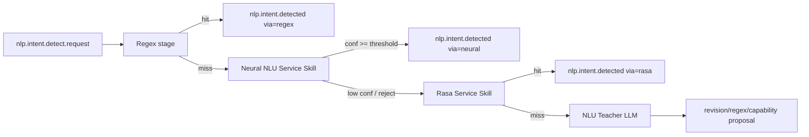

# NLU Target Architecture (Neural Intent Detector)

This document defines the **target architecture** for integrating a neural intent detector (reference: `Fla1lx/neural-network-module-for-determining-user-intent`) into AdaOS.

## Why this architecture

The referenced detector combines:

- Char-CNN + BiLSTM encoder,
- hybrid ranking (softmax + FAISS k-NN + skill priors),
- entity masking (`{time}`, `{city}`, `{number}`, ...),
- contrastive-friendly embedding space.

For AdaOS, this is a good fit between regex (fast deterministic) and LLM teacher (fallback + governance).

## Target runtime shape



## Components

### 1) Neural NLU Service Skill (`runtime.kind=service`)

A dedicated service skill with its own Python environment and lifecycle supervision.

Responsibilities:

- load model weights + tokenizer/masking config,
- expose `/health` and `/parse`,
- optionally expose `/reindex` for FAISS,
- return intent candidates with confidence and evidence.

### 2) Neural inference contract

`POST /parse` request:

```json
{ "text": "поставь будильник на 7:30", "webspace_id": "ws_1", "locale": "ru" }
```

Response:

```json
{
  "top_intent": "alarm.set",
  "confidence": 0.91,
  "alternatives": [{"intent":"timer.start","confidence":0.05}],
  "slots": {"time":"07:30"},
  "via": "neural",
  "evidence": {"softmax": 0.82, "knn": 0.88, "skill_prior": 0.9}
}
```

### 3) Hub bridge (`adaos.services.nlu.neural_service_bridge`)

Responsibilities:

- subscribe to `nlp.intent.detect.request`,
- invoke neural service with timeout/retry,
- apply confidence gates (`accept`, `abstain`, `reject`),
- emit:
  - `nlp.intent.detected` (`via="neural"`), or
  - `nlp.intent.not_obtained` / `nlp.intent.detect.rasa` fallback.

### 4) Data and model registry

`state/nlu/neural/` (versioned runtime artifacts):

- `model.pt`
- `faiss.index`
- `intents_manifest.json`
- `masking_rules.json`
- `metrics.json`

Model lifecycle:

- immutable model versions (`model_id`),
- canary switch per webspace,
- rollback by pointer change.

### 5) Governance and observability

Mandatory telemetry fields:

- latency (`stage=neural`),
- confidence distribution,
- fallback ratio (`neural -> rasa -> teacher`),
- per-intent precision/recall (offline eval),
- rejected/abstained samples for Teacher queue.

## Target decision policy

1. **Regex hit**: immediate accept.
2. **Neural high confidence** (`>= T_accept`): accept as final.
3. **Neural uncertainty** (`T_reject < conf < T_accept`): delegate to Rasa.
4. **No intent after Rasa**: delegate to Teacher.

Recommended initial thresholds:

- `T_accept = 0.80`
- `T_reject = 0.45`

Tune per locale/domain after offline evaluation.

## Implementation roadmap

## Phase 0 — Preparation (1 sprint)

- Define event and HTTP contracts for neural stage.
- Create `neural_nlu_service_skill` skeleton (healthcheck, config, supervisor integration).
- Add feature flags:
  - `ADAOS_NLU_NEURAL=1`
  - `ADAOS_NLU_NEURAL_TIMEOUT_S`
  - `ADAOS_NLU_NEURAL_MODEL_ID`

**Exit criteria:** service is startable, observable, and no-op safe when disabled.

## Phase 1 — Inference MVP (1–2 sprints)

- Integrate inference-only model (`model.pt` + preprocessing/masking).
- Implement `/parse` and hub bridge.
- Add confidence gating + fallback to Rasa.
- Add telemetry and structured logs.

**Exit criteria:** end-to-end event flow works, no regressions in existing regex/rasa path.

## Phase 2 — Hybrid ranking (1 sprint)

- Add FAISS retrieval and weighted scorer.
- Externalize weights:
  - `w_softmax`, `w_knn`, `w_skill_prior`.
- Log score components in `evidence`.

**Exit criteria:** measurable improvement on dev set and stable latency budget.

## Phase 3 — Teacher loop integration (1 sprint)

- Push abstained/low-confidence utterances to NLU Teacher queue.
- Teacher can propose:
  - regex fixes,
  - dataset revisions,
  - new intent/skill candidates.
- Add "accepted by teacher later" feedback channel for retraining.

**Exit criteria:** closed feedback loop from runtime misses to curated improvements.

## Phase 4 — ModelOps and rollout safety (1 sprint)

- Versioned model registry and rollback pointer.
- Canary rollout by webspace/tenant.
- Automatic quality gates before promoting model.

**Exit criteria:** controlled rollout with fast rollback and auditable model provenance.

## Phase 5 — Production hardening (ongoing)

- Multi-locale packs.
- Quantization/perf optimization.
- Drift detection and periodic reindex/retrain.
- Security review for model/data supply chain.

## Compatibility with current AdaOS NLU

This target architecture preserves current AdaOS strategy:

- regex remains first-stage deterministic policy,
- service-skill isolation remains the default runtime model,
- Rasa remains compatible fallback,
- Teacher remains improvement/governance mechanism.

The only structural change is adding a **neural service stage** between regex and Rasa.
