```mermaid
sequenceDiagram
    title Обновленная инициализация ADAos<br/>Процесс запуска с учетом типа узла и первоначальной настройки

    actor User as Пользователь
    participant Terminal as Терминал
    participant System as ADAos

    Note over User, System: == Запуск системы ==

    autonumber

    User->>Terminal: Пользователь вводит команду: adaos --start
    Terminal->>System: Передача команды на выполнение
    System->>System: Проверка прав доступа и корректности команды
    System->>System: **Определение типа узла: Хаб или Мембр**

    alt Тип узла: Хаб
        System->>System: Автоматическая регистрация в глобальной сети<br/>(ados-dev-root-init)
        System->>System: Отправка уведомления в Telegram: «Хаб поднят»
    else Тип узла: Мембр
        System->>System: Ожидание привязки к хабу<br/>(отложенное подключение)
    end

    System->>System: Проверка наличия и доступности микрофона

    alt Альтернативный сценарий 1: Микрофон недоступен
        System->>Terminal: Ошибка "Микрофон не найден"
        System->>System: Предложение альтернативного режима (CLI/браузер)
        alt Альтернативный ввод возможен
            System->>System: Продолжение в альтернативном режиме
        else Альтернативный ввод невозможен
            System-->>User: Завершение работы
        end
    end

    System->>System: Тестирование аудиовыхода (динамики/наушники)
    System->>System: Проверка подключения к интернету

    alt Альтернативный сценарий 2: Отсутствует интернет-подключение
        System->>System: Проверка типа узла
        alt Хаб
            System->>Terminal: Ошибка: "Хаб требует интернет-соединения"
            System-->>User: Завершение работы
        else Мембр
            System->>System: Проверка наличия сетевых настроек
            alt Настройки есть
                System->>System: Продолжение в offline-режиме
                System-->>System: **Переход к шагу 6 основного сценария**
            else Настроек нет → **Альтернативный сценарий 3**
                System->>System: Активация локального режима настройки
                Note right of System: Поднятие Wi-Fi AP / Bluetooth-сопряжения
                System->>Terminal: "Устройство ожидает настройку сети.<br/>Подключитесь к Wi-Fi 'ADAos-Setup-XXXX'"
                System->>System: Отображение QR-кода (если доступно)
                System->>System: Ожидание подключения владельца
                User->>System: Передача сетевых настроек<br/>(SSID, пароль, ID хаба)
                System->>System: Сохранение настроек сети
                System->>System: Перезапуск сетевого стека
                System->>System: **Возврат к проверке интернета**
            end
        end
    end

    System->>System: Загрузка модуля распознавания речи
    System->>System: Активация синтезатора речи
    System->>System: Загрузка языковых моделей и базы знаний
    System->>System: Инициализация профиля пользователя
    System->>System: **Проверка: первоначальный запуск?**

    alt Первоначальный запуск (первая установка)
        System->>System: Генерация одноразового кода доступа
        System->>Terminal: Вывод инструкции:<br/>"Откройте браузер, перейдите на [адрес],<br/>введите код: XXXX"
        System->>System: Активация веб-интерфейса для владельца
        System->>System: Предложение интерактивной первоначальной настройки
        System->>System: Запуск установки предустановленных навыков/приложений
    end

    System->>System: Воспроизведение тона готовности
    Note right of System: Короткий мелодичный тон
    System->>System: Синтез голосового сообщения
    Note right of System: "ADAos активирована. Система готова к работе"
    System->>Terminal: Визуальный статус: [STATUS: READY]
    System->>Terminal: Справочная информация
    Note right of System: "Произнесите 'Помощь' для списка команд"
    System->>System: Активация непрерывного прослушивания
    System->>System: Запуск индикации уровня звука
    Note right of System: Режим реального времени
    System->>System: Готовность к обработке голосовых команд
    System-->>User: Система полностью инициализирована
```

# Сценарий 1. Первоначальный Запуск ОС

**История изменений**

| **Дата изменения** | **Версия** | **Описание изменений**               | **Автор изменений** |
|-------------------|------------|--------------------------------------|---------------------|
| 09.11.2025        | v0.0.1     | Первоначальная версия документа      | Кондрашенков С.А.   |

---

| **№** | **User Story**           |
|-------|--------------------------|
| US_1.0 | Первоначальный Запуск ОС |

---

**Use Case**

| **Наименование**       | **Описание**                                                                 |
|------------------------|-----------------------------------------------------------------------------|
| Название сценария      | Первоначальный Запуск ОС                                                    |
| Цель                   | Инициировать и завершить первичную загрузку операционной системы ADAos, активировать её голосовой интерфейс и перевести систему в базовое рабочее состояние, готовое к взаимодействию с пользователем. |
| Участники (акторы)     | - Пользователь - AdaOS                                                  |
| Предусловие            | - Завершена загрузка ядра ОС - Инициализированы базовые системные сервисы - Загружены драйверы аудиоустройств |
| Триггер                | Пользователь вводит в командной строке команду: `adaos --start`          |
| Постусловие            | - Голосовой интерфейс ADA активен - Микрофон и динамики готовы к работе - Система ожидает голосовые команды |
| Результат              | Пользователь получает аудио-визуальное подтверждение успешной загрузки системы и готовности ADA к взаимодействию |

---

**Основной сценарий**

1. Пользователь вводит в терминале команду: `adaos --start`
2. ADAos проверяет права доступа и корректность команды
3. ADAos определяет **тип узла**: **хаб** (центральный узел подсети) или **мембр** (периферийное устройство)
   - *Если хаб*:
     - Выполняется автоматическая регистрация в глобальной сети через `ados-dev-root-init`
     - Отправляется уведомление в Telegram: «Хаб поднят»
   - *Если мембр*:
     - Ожидается привязка к хабу (этап подключения отложен до наличия интернета или настройки)
4. ADAos проверяет наличие и доступность микрофона
5. ADAos тестирует аудиовыход (динамики/наушники)
6. ADAos проверяет подключение к интернету
   - *Если интернет отсутствует и устройство — мембр без настроек Wi-Fi*:  
     → Переход к **новому альтернативному сценарию 3** (см. ниже)
7. ADAos загружает модуль распознавания речи
8. ADAos активирует синтезатор речи
9. ADAos загружает языковые модели и базу знаний (при наличии интернета)
10. ADAos инициализирует профиль пользователя
11. ADAos **проверяет, является ли запуск первоначальным** (первый запуск после установки):
    - Если **да**:
      - Генерирует одноразовый код доступа
      - Выводит инструкцию:  
        *«Откройте браузер, перейдите на [адрес], введите код: XXXX»*
      - Активирует веб-интерфейс для владельца (браузерный доступ к настройкам)
      - Предлагает пройти **интерактивную первоначальную настройку** (голосом или через браузер)
      - Запускает процедуру установки предустановленных навыков/приложений, **включая их setup-сценарии** (если требуются настройки: API-ключи, геолокация и т.п.)
12. ADAos воспроизводит звуковой сигнал готовности (короткий мелодичный тон)
13. ADAos произносит голосовое сообщение: *«ADAos активирована. Система готова к работе»*
14. ADAos выводит в терминал:
    - `[STATUS: READY]`
    - *«Произнесите "Помощь" для списка команд»*
15. ADAos активирует непрерывное прослушивание
16. ADAos запускает индикацию уровня звука в реальном времени
17. ADAos переходит в режим ожидания первой команды

**Альтернативный сценарий 1: Микрофон недоступен**

1. ADAos проверяет подключение к интернету
2. ADAos обнаруживает отсутствие интернета
3. **Если это хаб**:
   - Выводит ошибку: *«Ошибка: Хаб требует интернет-соединения для регистрации в глобальной сети»*
   - Завершает работу
4. **Если это мембр**:
   - Проверяет, настроено ли ранее подключение к Wi-Fi / хабу
     - **Если нет** → Переход к **Альтернативному сценарию 3**
     - **Если да** → Продолжает работу в offline-режиме (ограниченная функциональность)

**Альтернативный сценарий 2: Отсутствует интернет-подключение**

1. ADAos определяет, что устройство — **новая мембр-нода без сетевых настроек**
2. ADAos активирует **локальный режим настройки**:
   - Поднимает временный Wi-Fi AP (точку доступа) **ИЛИ** включает Bluetooth-режим сопряжения
   - Выводит в терминал:  
     *«Устройство ожидает настройку сети. Подключитесь к Wi-Fi "ADAos-Setup-XXXX" или сопрягите по Bluetooth»*
   - Отображает QR-код с данными для подключения (если есть графический вывод)
3. Ожидает подключения владельца (с телефона/ПК) и передачи:
   - SSID и пароля Wi-Fi
   - Идентификатора хаба (опционально)
4. После получения данных:
   - Сохраняет настройки
   - Перезапускает сетевой стек
   - Продолжает основной сценарий с шага 6

**Альтернативный сценарий 3: Нет интернета + устройство требует первоначальной настройки сети**

1. ADAos определяет, что устройство — новая мембр-нода без сетевых настроек
2. ADAos активирует локальный режим настройки:
   - Поднимает временный Wi-Fi AP (точку доступа) ИЛИ включает Bluetooth-режим сопряжения
   - Выводит в терминал:  
     «Устройство ожидает настройку сети. Подключитесь к Wi-Fi "ADAos-Setup-XXXX" или сопрягите по Bluetooth»
3. Отображает QR-код с данными для подключения (если есть графический вывод)
4. Ожидает подключения владельца (с телефона/ПК) и передачи:
   - SSID и пароля Wi-Fi
   - Идентификатора хаба (опционально)
5. После получения данных:
   - Сохраняет настройки
   - Перезапускает сетевой стек
   - Продолжает основной сценарий с шага 6

