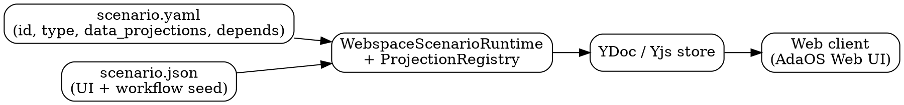
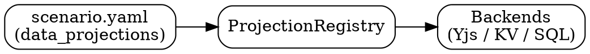

# Первый запуск сценария и `data_projections`

В этой заметке разбираем, как сценарии запускаются впервые и как
`data_projections` связывает концептуальное состояние с физическим
хранилищем (Yjs, KV, SQL) внутри AdaOS.

Это дополняет:

- `docs/scenarios.md` — манифесты сценариев и desktop‑UI.
- `src/adaos/services/scenario/projection_registry.py` — загрузка и разрешение projection’ов.

---

## 1. Манифест сценария и первый запуск

Манифест сценария лежит по пути:

```text
.adaos/workspace/scenarios/<id>/scenario.yaml
```

Пример простого процедурного сценария `greet_on_boot`:

```yaml
id: greet_on_boot
version: 0.1.0
title: Greet on boot
description: >
  Greets the user on first boot, collects basic profile info and shows quickstart tips.
steps:
  - name: ask_name
    call: io.console.print
    args:
      text: "Hi! What's your name?"
  - name: get_name
    call: io.voice.stt.listen
    save_as: user_name
  - name: greet
    call: io.voice.tts.speak
    args:
      text: "Nice to meet you, ${user_name}!"
```

Такие сценарии выполняет процедурный `ScenarioRuntime`
(см. `src/adaos/sdk/scenarios/runtime.py`) и они не определяют UI —
их можно запускать из CLI или кода Python.

Desktop‑сценарии (например, `web_desktop` и `prompt_engineer_scenario`)
дополнительно имеют `scenario.json`, который описывает seed UI и workflow
для Yjs, но идентичность и `data_projections` остаются в `scenario.yaml`.

---

## 2. `data_projections`: связывание слотов с хранилищем

Секция `data_projections` в `scenario.yaml` описывает, как логические пары
`(scope, slot)` сопоставляются с конкретными backend’ами хранения.
На рантайме это загружается `ProjectionRegistry` и используется
SDK‑хелперами (например, `ctx.*`) для маршрутизации чтений и записей.

Пример из `web_desktop`:

```yaml
id: web_desktop
version: 0.0.1
title: Web Desktop
description: Desktop shell scenario that defines the main UI layout, registry and base catalog.
type: desktop
depends:
  - web_desktop_skill
updated_at: "2025-11-14T18:14:36+00:00"
data_projections:
  - scope: current_user
    slot: profile.settings
    targets:
      - backend: kv
      - backend: yjs
        path: data/skills/profile/{user_id}/settings
  - scope: subnet
    slot: weather.snapshot
    targets:
      - backend: yjs
        path: data/weather
```

На уровне реализации `ProjectionRegistry` строит таблицу соответствий
между `(scope, slot)` и backend’ами + путями. SDK‑слой (контекст `ctx`)
инкуapsулирует детали, так что LLM‑программисту достаточно думать о слотах,
а не о конкретных Yjs‑путях или ключах в KV.

---

## 3. Конвейер desktop‑сценария

Для desktop‑кейсов важно понимать полный конвейер
от описаний до web‑клиента:



Коротко:

- `scenario.yaml` задаёт идентичность сценария, тип, зависимости и `data_projections`.
- `scenario.json` описывает изначальную модель UI (widgets, модалки, каталоги).
- `WebspaceScenarioRuntime` и `ProjectionRegistry` объединяют это в структуру Yjs (YDoc).
- Web‑клиент подписывается на YDoc и рендерит интерфейс.

---

## 4. Диаграмма для `data_projections`

Ещё один взгляд на слой проекций:



Идея: сценарий описывает «что и где хранить», `ProjectionRegistry`
переводит это в структуру данных, а конкретные backend’ы отвечают
за физическое состояние.

