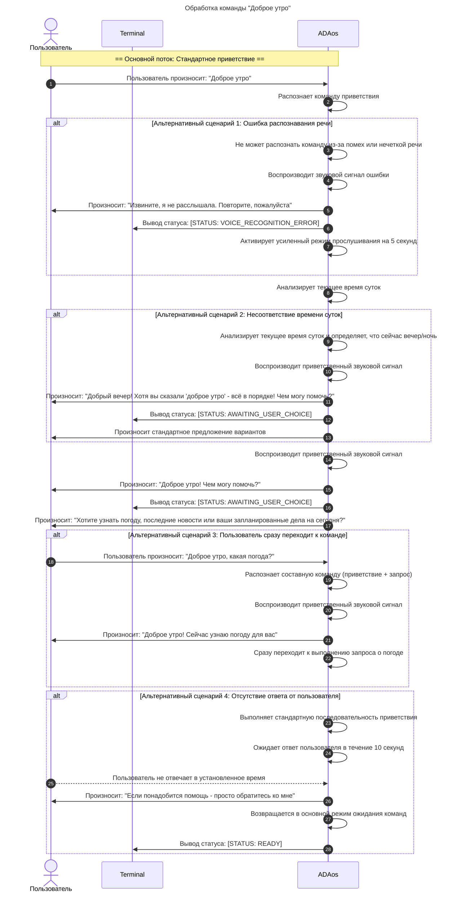

# Сценарий 2. "Доброе утро"

**История изменений**

| **Дата изменения** | **Версия** | **Описание изменений**          | **Автор изменений** |
|--------------------|------------|--------------------------------|---------------------|
| 09.11.2025         | v0.0.1     | Первоначальная версия документа | Бухаров Р.Р.        |

---

| **№**      | **User Story** |
|------------|----------------|
| US_1.1     | "Доброе утро"  |

---

**Use Case**

| **Наименование**       | **Описание**                                                                 |
|------------------------|-----------------------------------------------------------------------------|
| Название сценария      | "Доброе утро"                                                               |
| Цель                   | Принять голосовое приветствие пользователя и предложить варианты утренней информации для дальнейшего взаимодействия |
| Участники (акторы)     | - Пользователь - AdaOS                                                  |
| Предусловие            | - Система ADAos активна и находится в режиме ожидания голосовых команд - Микрофон доступен и функционирует - Модули распознавания и синтеза речи активны |
| Триггер                | Пользователь произносит фразу "Доброе утро"                                 |
| Постусловие            | - Система переходит в режим ожидания выбора пользователя - В терминале отображается статус [STATUS: AWAITING_USER_CHOICE] - Активен таймер ожидания ответа (10 секунд) |
| Результат              | Пользователь получил голосовое приветствие и предложение выбора между погодой, новостями или запланированными делами, проверить состояние аппартуры. Система готова к обработке следующей голосовой команды |

---

**Основной сценарий**

1. **Пользователь** произносит: "Доброе утро"
2. **ADAos** распознает команду приветствия
3. **ADAos** анализирует текущее время суток
4. **ADAos** воспроизводит приветственный звуковой сигнал
5. **ADAos** произносит: "Доброе утро! Чем могу помочь?"
6. **ADAos** выводит в терминал статус: [STATUS: AWAITING_USER_CHOICE]
7. **ADAos** произносит: "Хотите узнать погоду, последние новости или ваши запланированные дела на сегодня?"

---

**Альтернативный сценарий 1: Ошибка распознавания речи**

1. Пользователь произносит: "Доброе утро"
2. ADAos не может распознать команду из-за помех или нечеткой речи
3. ADAos воспроизводит звуковой сигнал ошибки
4. ADAos произносит: "Извините, я не расслышала. Повторите, пожалуйста"
5. ADAos выводит в терминал статус: [STATUS: VOICE_RECOGNITION_ERROR]
6. ADAos активирует усиленный режим прослушивания на 5 секунд

**Альтернативный сценарий 2: Несоответствие времени суток**

1. ADAos анализирует текущее время суток и определяет, что сейчас вечер/ночь
2. ADAos воспроизводит приветственный звуковой сигнал
3. ADAos произносит: "Добрый вечер! Хотя вы сказали 'доброе утро' - всё в порядке! Чем могу помочь?"
4. ADAos выводит в терминал статус: [STATUS: AWAITING_USER_CHOICE]
5. ADAos произносит стандартное предложение вариантов

**Альтернативный сценарий 3: Пользователь сразу переходит к команде**

1. Пользователь произносит: "Доброе утро, какая погода?"
2. ADAos распознает составную команду (приветствие + запрос)
3. ADAos воспроизводит приветственный звуковой сигнал
4. ADAos произносит: "Доброе утро! Сейчас узнаю погоду для вас"
5. ADAos сразу переходит к выполнению запроса о погоде

**Альтернативный сценарий 4: Отсутствие ответа от пользователя**

1. Пользователь произносит: "Доброе утро"
2. ADAos выполняет стандартную последовательность приветствия
3. ADAos ожидает ответ пользователя в течение 10 секунд
4. Пользователь не отвечает в установленное время
5. ADAos произносит: "Если понадобится помощь - просто обратитесь ко мне"
6. ADAos возвращается в основной режим ожидания команд
7. ADAos выводит в терминал статус: [STATUS: READY]

