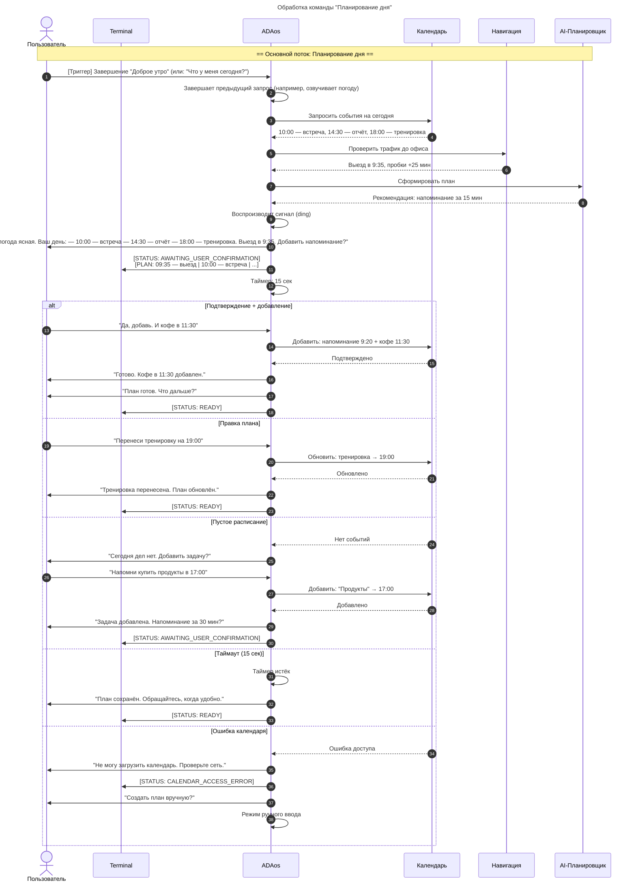

# Сценарий 1. "Планирование дня"

**История изменений**

| **Дата изменения** | **Версия** | **Описание изменений** | **Автор изменений** |
|--------------------|------------|------------------------|---------------------|
| 09.11.2025         | v0.0.1     | Планирование дня       | Кузьмин Е.О.        |

---

| **№**      | **User Story** |
|------------|----------------|
| US_1.2     | Планирование дня |

---

**Use Case**

| **Наименование**       | **Описание**                                                                 |
|------------------------|-----------------------------------------------------------------------------|
| Название сценария      | "Планирование дня"                                                          |
| Цель                   | Сформировать и озвучить персонализированный план дня, предложить оптимизации маршрутов и времени, получить подтверждение или внести корректировки, перевести систему в режим ожидания следующей команды. |
| Участники (акторы)     | - Пользователь - AdaOS                                                  |
| Предусловие            | - Система ADAos активна и находится в режиме [STATUS: AWAITING_USER_CHOICE] после сценария "Доброе утро" - Пользователь выбрал хотя бы один из вариантов (погода/новости/дела) или пропустил выбор - Модули календаря, навигации, задач и ИИ-планировщика активны - Микрофон и динамики функционируют - Доступ к актуальным данным о трафике и погоде |
| Триггер                | - Завершение сценария "Доброе утро" (пользователь ответил на предложение или истёк таймер 10 сек) - Или пользователь явно говорит: "Что у меня сегодня?" / "Спланируй день" |
| Постусловие            | - Система переходит в режим [STATUS: AWAITING_USER_CONFIRMATION] или [STATUS: READY] - В терминале отображается статус [STATUS: AWAITING_USER_CONFIRMATION] - Активен таймер ожидания ответа (15 секунд) - План дня сохранён в временном буфере для возможных правок |
| Результат              | - Пользователь получил краткий обзор расписания с предложениями по оптимизации - Система готова к обработке подтверждений, правок или новой команды - При отсутствии ответа — возврат в базовое состояние ожидания |

---

**Основной сценарий**

1. **Триггер**: Пользователь завершил сценарий "Доброе утро" (например, сказал "Погоду, пожалуйста")
2. AdaOS завершает выполнение выбранного запроса (озвучивает погоду)
3. AdaOS анализирует календарь на текущий день
4. AdaOS воспроизводит переходный звуковой сигнал (мягкий "ding")
5. AdaOS произносит: "Хорошо, погода ясная. Теперь о вашем дне. У вас: — 10:00 — встреча с командой в офисе — 14:30 — дедлайн по отчёту — 18:00 — тренировка в зале на Ленина, 12. Рекомендую выехать в 9:35 — пробки на выезде из района. Добавить напоминание за 15 минут?"
6. AdaOS выводит в терминал:
   - [STATUS: AWAITING_USER_CONFIRMATION]
   - [PLAN: 09:35 — выезд | 10:00 — встреча | 14:30 — отчёт | 18:00 — тренировка]
7. AdaOS активирует таймер ожидания (15 сек)

---

**Альтернативные сценарии**

**Альтернативный сценарий 1: Пользователь подтверждает план**
- Пользователь: "Да, добавь напоминание. И кофе в 11:30"
- AdaOS: "Отлично. Напоминание за 15 минут до выезда — установлено. Кофе-брейк в 11:30 — добавлен между встречей и отчётом."
- AdaOS обновляет план и сохраняет в календарь
- AdaOS: "План готов. Что дальше?"
- AdaOS выводит: [STATUS: READY]

**Альтернативный сценарий 2: Пользователь вносит правки**
- Пользователь: "Перенеси тренировку на 19:00"
- AdaOS: "Тренировка перенесена на 19:00. Зал подтвердил свободное окно. Обновить?"
- Пользователь: "Да"
- AdaOS: "Готово. План обновлён."
- Переход в [STATUS: READY]

**Альтернативный сценарий 3: Пустое расписание**
- AdaOS: "На сегодня у вас нет запланированных дел. Хотите добавить задачу или встречу?"
- Пользователь: "Напомни купить продукты в 17:00"
- AdaOS: "Задача 'купить продукты' добавлена на 17:00. Напоминание за 30 минут?"
- Переход в режим подтверждения

**Альтернативный сценарий 4: Отсутствие ответа (таймаут)**
- Прошло 15 секунд без ответа
- AdaOS: "Похоже, вы заняты. План сохранён в фоне. Обращайтесь, когда будет удобно."
- AdaOS возвращается в [STATUS: READY]
- План остаётся доступным по команде "Покажи план"

**Альтернативный сценарий 5: Ошибка доступа к календарю**
- AdaOS не может получить данные календаря
- AdaOS: "Не могу загрузить ваш календарь. Проверьте подключение или права доступа."
- AdaOS выводит: [STATUS: CALENDAR_ACCESS_ERROR]
- Предлагает: "Хотите создать план вручную?"
- Переход в режим ручного ввода задач

