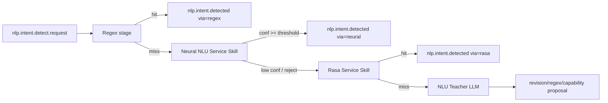

# Целевая архитектура NLU (нейросетевой детектор намерений)

Документ описывает **целевую архитектуру** интеграции нейросетевого детектора интентов (референс: `Fla1lx/neural-network-module-for-determining-user-intent`) в AdaOS.

## Зачем

В репозитории-референсе используется комбинация:

- Char-CNN + BiLSTM энкодер,
- гибридный ранжировщик (softmax + FAISS k-NN + веса навыков),
- маскирование сущностей (`{time}`, `{city}`, `{number}`, ...),
- эмбеддинги с contrastive-компонентой лосса.

Для AdaOS это естественный промежуточный слой между regex (детерминированно и быстро) и NLU Teacher (LLM fallback + governance).

## Целевая форма runtime



## Компоненты

### 1) Neural NLU Service Skill (`runtime.kind=service`)

Отдельный service-skill со своим Python-окружением и supervision.

Задачи:

- загрузка весов модели + конфигов токенизации/маскирования,
- API `/health` и `/parse`,
- опционально `/reindex` для FAISS,
- возврат кандидатов интентов с confidence и evidence.

### 2) Контракт инференса

`POST /parse` request:

```json
{ "text": "поставь будильник на 7:30", "webspace_id": "ws_1", "locale": "ru" }
```

Response:

```json
{
  "top_intent": "alarm.set",
  "confidence": 0.91,
  "alternatives": [{"intent":"timer.start","confidence":0.05}],
  "slots": {"time":"07:30"},
  "via": "neural",
  "evidence": {"softmax": 0.82, "knn": 0.88, "skill_prior": 0.9}
}
```

### 3) Hub bridge (`adaos.services.nlu.neural_service_bridge`)

Задачи:

- подписка на `nlp.intent.detect.request`,
- вызов neural-сервиса с timeout/retry,
- применение confidence-порогов (`accept`, `abstain`, `reject`),
- публикация:
  - `nlp.intent.detected` (`via="neural"`), или
  - `nlp.intent.not_obtained` / `nlp.intent.detect.rasa` (fallback).

### 4) Реестр данных и моделей

`state/nlu/neural/` (версионированные runtime-артефакты):

- `model.pt`
- `faiss.index`
- `intents_manifest.json`
- `masking_rules.json`
- `metrics.json`

Жизненный цикл модели:

- immutable-версии (`model_id`),
- canary-переключение по webspace,
- rollback через смену указателя версии.

### 5) Governance и observability

Обязательные метрики:

- latency (`stage=neural`),
- распределение confidence,
- доля fallback (`neural -> rasa -> teacher`),
- per-intent precision/recall (off-line),
- rejected/abstained запросы для Teacher-очереди.

## Целевая политика принятия решения

1. **Regex hit**: принимаем сразу.
2. **Neural high confidence** (`>= T_accept`): принимаем как финальный результат.
3. **Neural uncertainty** (`T_reject < conf < T_accept`): передаем в Rasa.
4. **Нет интента после Rasa**: передаем в Teacher.

Рекомендуемые стартовые пороги:

- `T_accept = 0.80`
- `T_reject = 0.45`

Далее настраиваются по локали и домену после off-line оценки.

## Дорожная карта реализации

## Фаза 0 — Подготовка (1 спринт)

- Зафиксировать event- и HTTP-контракты neural-стадии.
- Создать каркас `neural_nlu_service_skill` (healthcheck, config, supervisor integration).
- Добавить feature flags:
  - `ADAOS_NLU_NEURAL=1`
  - `ADAOS_NLU_NEURAL_TIMEOUT_S`
  - `ADAOS_NLU_NEURAL_MODEL_ID`

**Критерий выхода:** сервис запускается, наблюдаем и безопасно отключаем флагом.

## Фаза 1 — Inference MVP (1–2 спринта)

- Подключить inference-only модель (`model.pt` + preprocessing/masking).
- Реализовать `/parse` и bridge в hub.
- Добавить confidence gating + fallback в Rasa.
- Добавить телеметрию и структурные логи.

**Критерий выхода:** сквозной event-flow работает без регрессий текущего regex/rasa пути.

## Фаза 2 — Гибридное ранжирование (1 спринт)

- Добавить FAISS retrieval и взвешенный scorer.
- Вынести веса в конфиг:
  - `w_softmax`, `w_knn`, `w_skill_prior`.
- Логировать компоненты оценки в `evidence`.

**Критерий выхода:** измеримое улучшение на dev-наборе при стабильной latency.

## Фаза 3 — Интеграция с Teacher loop (1 спринт)

- Отправлять abstain/low-confidence запросы в очередь NLU Teacher.
- Teacher предлагает:
  - regex-правки,
  - ревизии датасета,
  - кандидаты новых интентов/навыков.
- Добавить канал обратной связи "accepted by teacher later" для переобучения.

**Критерий выхода:** замкнутый цикл улучшений от runtime-промахов до curated-улучшений.

## Фаза 4 — ModelOps и безопасный rollout (1 спринт)

- Версионированный реестр моделей и rollback-pointer.
- Canary rollout по webspace/tenant.
- Автопроверки качества перед promotion.

**Критерий выхода:** управляемый rollout с быстрым rollback и аудируемой provenance модели.

## Фаза 5 — Production hardening (ongoing)

- Пакеты для нескольких локалей.
- Квантизация и оптимизация производительности.
- Drift detection, периодический reindex/retrain.
- Security review цепочки поставки модели и данных.

## Совместимость с текущим NLU AdaOS

Целевая архитектура не ломает текущую стратегию:

- regex остается первым детерминированным слоем,
- service-skill изоляция сохраняется,
- Rasa остается fallback-уровнем,
- Teacher остается механизмом улучшения и governance.

Структурное изменение только одно: добавляется **neural stage** между regex и Rasa.
